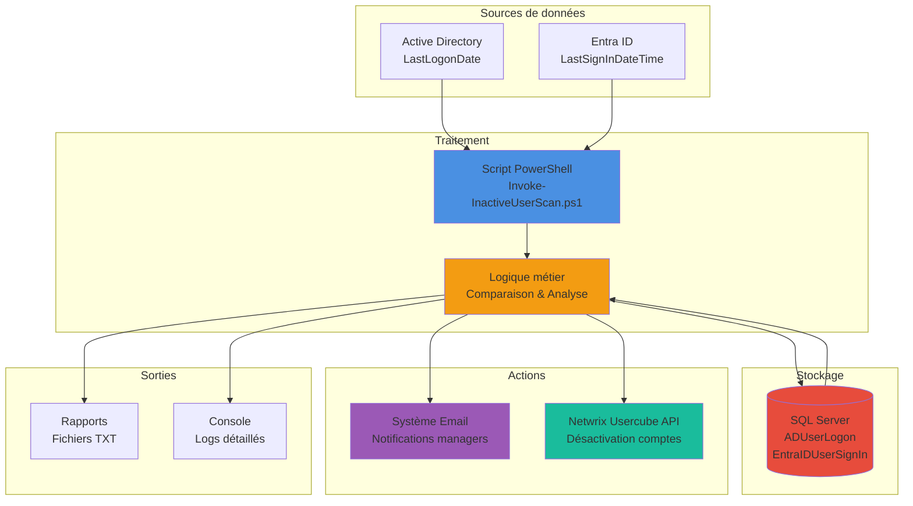
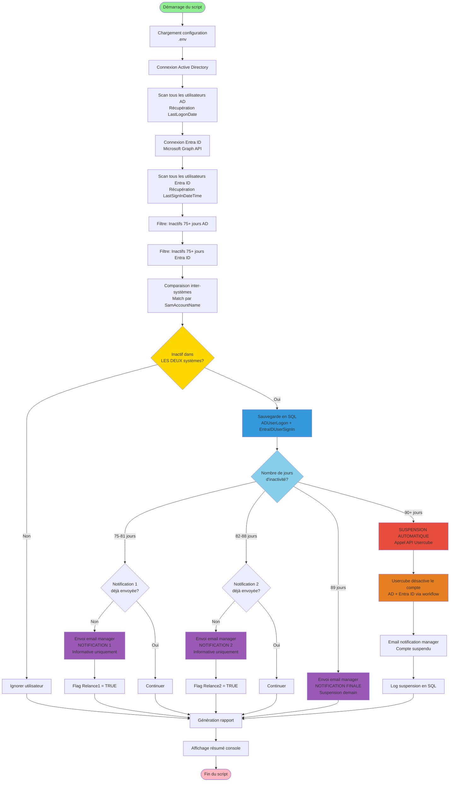

# Identity Lifecycle Cleanup


## Description

Solution d'automatisation PowerShell pour identifier et gérer automatiquement les comptes utilisateurs inactifs dans **Active Directory** et **Entra ID** (Azure AD). Ce système assure la conformité de sécurité ISO27001 en désactivant automatiquement les comptes dormants après 90 jours d'inactivité via **Netwrix Usercube**, avec un système de notifications progressives aux managers.

### Fonctionnalités principales

- 🔍 **Détection automatique multi-sources** - Surveillance de l'activité utilisateur depuis Active Directory et Entra ID
- 🔄 **Comparaison inter-systèmes** - Identifie les utilisateurs inactifs dans les DEUX systèmes simultanément
- 📧 **Système de notifications progressives** - Alertes informatives aux managers (J75, J82, J89)
- ⚙️ **Suspension automatique via Usercube** - Désactivation des comptes au jour 90 via appel API Usercube
- 📊 **Intégration SQL Server** - Historique complet pour audit et conformité
- ⏰ **Seuils configurables** - Périodes d'inactivité personnalisables (défaut: 75-90 jours)
- 🔐 **Conformité ISO27001** - Répond aux exigences IAM Gap Analysis (5.18_6)
- 🔄 **Reset automatique** - Seule façon d'éviter la suspension : l'utilisateur doit se reconnecter

---

## Architecture du système



---

## Flux de processus complet



---

## Structure de la base de données

Le système utilise deux tables principales pour stocker les données d'activité utilisateur :

```sql
-- Table 1: Utilisateurs Active Directory
CREATE TABLE ADUserLogon (
    Id INT PRIMARY KEY IDENTITY(1,1),
    SamAccountName VARCHAR(100) NOT NULL,
    Name VARCHAR(200) NOT NULL,
    Status VARCHAR(500),                     -- Statut du compte (Enabled/Disabled)
    LastLogon DATETIME,                      -- Dernière connexion AD
    Days INT,                                -- Jours depuis dernière connexion
    Mail VARCHAR(100),                       -- Email utilisateur
    MailManager VARCHAR(100),                -- Email du manager (notifications)
    Relance1 BIT DEFAULT 0,                  -- Première notification envoyée
    Relance2 BIT DEFAULT 0,                  -- Deuxième notification envoyée
    AccountSuspendedDate DATETIME,           -- Date de suspension automatique
    UsercubeDisabled BIT DEFAULT 0,          -- Compte désactivé via Usercube
    CreatedDate DATETIME DEFAULT GETDATE(),  -- Date création enregistrement
    LastModifiedDate DATETIME                -- Date dernière modification
)

-- Table 2: Utilisateurs Entra ID
CREATE TABLE EntraIDUserSignIn (
    Id INT PRIMARY KEY IDENTITY(1,1),
    DisplayName NVARCHAR(255),
    UserPrincipalName NVARCHAR(255),
    LastSignIn DATETIME,                     -- Dernière connexion Entra ID
    AccountEnabled BIT,                      -- Compte activé ou non
    CreatedDateTime DATETIME,                -- Date création compte
    Mail NVARCHAR(255),
    CreatedDate DATETIME DEFAULT GETDATE(),  -- Date création enregistrement
    LastModifiedDate DATETIME                -- Date dernière modification
)

-- Index pour optimisation des requêtes
CREATE INDEX IX_ADUserLogon_SamAccountName ON ADUserLogon(SamAccountName)
CREATE INDEX IX_ADUserLogon_Days ON ADUserLogon(Days)
CREATE INDEX IX_ADUserLogon_Suspended ON ADUserLogon(AccountSuspendedDate)
CREATE INDEX IX_EntraIDUserSignIn_UPN ON EntraIDUserSignIn(UserPrincipalName)
```

---

## Chronologie détaillée du processus

| Jour | Événement | Action automatique | Notification |
|------|-----------|-------------------|--------------|
| **J0** | Dernière connexion utilisateur | - | - |
| **J1-74** | Période de grâce | Script surveille (aucune action) | - |
| **J75** | Seuil d'alerte atteint | Email NOTIFICATION 1 au manager<br/>Flag `Relance1 = TRUE` | ⚠️ Information : Compte inactif depuis 75 jours<br/>Suspension prévue dans 15 jours |
| **J82** | 1 semaine après J75 | Email NOTIFICATION 2 au manager<br/>Flag `Relance2 = TRUE` | ⚠️ Rappel : Compte inactif depuis 82 jours<br/>Suspension prévue dans 8 jours |
| **J89** | 1 semaine après J82 | Email NOTIFICATION FINALE au manager | 🚨 Alerte : Suspension automatique DEMAIN |
| **J90** | Seuil critique atteint | **SUSPENSION AUTOMATIQUE**<br/>- Appel API Usercube<br/>- Usercube désactive AD + Entra ID<br/>- Log en SQL<br/>- Email manager (information suspension) | ✋ Compte suspendu automatiquement via Usercube |

### Mécanisme de prévention

**Seule façon d'éviter la suspension** : L'utilisateur doit se reconnecter à son compte (Outlook, VPN, portail web, etc.)

- **Reconnexion utilisateur** (n'importe quand entre J0-J90) :
  - Active Directory met à jour automatiquement `LastLogonDate`
  - Entra ID met à jour automatiquement `LastSignInDateTime`
  - Lors du prochain scan, le script détecte que l'utilisateur est actif
  - **Processus annulé automatiquement**
  - Les flags `Relance1` et `Relance2` sont réinitialisés
  - Aucune suspension n'est appliquée

---

## Installation et configuration

### Prérequis

- **PowerShell** 5.1 ou supérieur
- **Modules PowerShell** :
  - `Microsoft.Graph.Authentication` (connexion Entra ID)
  - `ActiveDirectory` (connexion AD)
- **SQL Server** avec droits CREATE, INSERT, UPDATE, TRUNCATE
- **Netwrix Usercube** (requis pour désactivation des comptes)
- **Permissions requises** :
  - **Entra ID** : `User.Read.All`, `AuditLog.Read.All` (via App Registration)
  - **Active Directory** : Lecture objets utilisateurs + propriété `LastLogonDate`
  - **SQL Server** : Accès en écriture à la base cible
  - **SMTP** : Serveur email pour envoi notifications
  - **Netwrix Usercube API** : Clé API avec droits de désactivation utilisateurs

---

### 1. Initialisation de la base de données

Créez la structure SQL nécessaire :

```powershell
.\scripts\INIT_DATABASE.ps1
```

Ce script crée :
- La base de données configurée
- Les tables `ADUserLogon` et `EntraIDUserSignIn`
- Les index pour optimisation

---

### 2. Configuration

Créez un fichier `.env` dans le dossier `config\` :

```env
# ========================================
# Configuration Entra ID
# ========================================
TENANT_ID=xxxxxxxx-xxxx-xxxx-xxxx-xxxxxxxxxxxx
CLIENT_ID=xxxxxxxx-xxxx-xxxx-xxxx-xxxxxxxxxxxx
CLIENT_SECRET=votre-secret-client

# ========================================
# Configuration Active Directory
# ========================================
AD_SERVER=dc01.votredomaine.local
AD_USERNAME=DOMAINE\admin
AD_PASSWORD=votre-mot-de-passe

# ========================================
# Configuration SQL Server
# ========================================
SQL_SERVER=sql-server.votredomaine.local
SQL_DATABASE=IdentityLifecycle
SQL_USERNAME=sql_admin
SQL_PASSWORD=votre-mot-de-passe-sql

# ========================================
# Configuration Email (SMTP)
# ========================================
SMTP_SERVER=smtp.office365.com
SMTP_PORT=587
SMTP_USERNAME=notifications@votredomaine.com
SMTP_PASSWORD=votre-mot-de-passe-smtp
SMTP_FROM=noreply@votredomaine.com
SMTP_USE_SSL=true

# ========================================
# Configuration Netwrix Usercube (REQUIS)
# ========================================
USERCUBE_API_URL=https://usercube.votredomaine.local/api
USERCUBE_API_KEY=votre-cle-api
USERCUBE_DISABLE_ENDPOINT=/users/disable    # Endpoint pour désactiver un compte

# ========================================
# Paramètres de seuils
# ========================================
INACTIVE_DAYS_THRESHOLD=75           # Début des notifications (jour 75)
SUSPENSION_DAYS_THRESHOLD=90         # Suspension automatique (jour 90)
```

---

### 3. Enregistrement d'application Entra ID

Pour permettre au script d'accéder à Entra ID via Microsoft Graph :

1. **Azure Portal** → **App registrations** → **New registration**
2. Nom : `Identity-Lifecycle-Cleanup`
3. **API Permissions** → Add :
   - `User.Read.All` (Application)
   - `AuditLog.Read.All` (Application)
4. **Certificates & secrets** → New client secret
5. Copier le **Client ID**, **Tenant ID** et **Client Secret** dans `.env`
6. **Grant admin consent** pour les permissions

---

## Utilisation

### Exécution manuelle

```powershell
# Scan standard (AD + Entra ID)
.\Invoke-InactiveUserScan.ps1

# Avec seuil personnalisé (80 jours au lieu de 75)
.\Invoke-InactiveUserScan.ps1 -InactiveDays 80

# Mode verbose (debug)
.\Invoke-InactiveUserScan.ps1 -Verbose

# Ignorer Entra ID (AD seulement)
.\Invoke-InactiveUserScan.ps1 -SkipEntraId

# Ignorer AD (Entra ID seulement)
.\Invoke-InactiveUserScan.ps1 -SkipAD

# Mode test (pas d'envoi emails, pas de suspension)
.\Invoke-InactiveUserScan.ps1 -WhatIf
```

---

### Planification automatique (recommandé)

**Windows Task Scheduler** - Exécution quotidienne à 8h00 :

```powershell
$action = New-ScheduledTaskAction -Execute "PowerShell.exe" `
    -Argument "-ExecutionPolicy Bypass -File C:\Scripts\Identity-Lifecycle-Cleanup\Invoke-InactiveUserScan.ps1"

$trigger = New-ScheduledTaskTrigger -Daily -At 8:00AM

$principal = New-ScheduledTaskPrincipal -UserId "DOMAIN\ServiceAccount" `
    -LogonType Password -RunLevel Highest

Register-ScheduledTask -TaskName "Identity-Lifecycle-Cleanup" `
    -Action $action -Trigger $trigger -Principal $principal `
    -Description "Scan quotidien des comptes utilisateurs inactifs"
```

---

## Rapports générés

### 1. Rapport console (sortie standard)

```
========================================
IDENTITY LIFECYCLE CLEANUP
========================================

[1/6] Chargement configuration...
  [OK] Configuration chargée
  Seuil d'inactivité: 75 jours

[2/6] Scan Active Directory...
  [OK] 1,247 utilisateurs actifs scannés
  [OK] 23 utilisateurs inactifs détectés

[3/6] Scan Entra ID...
  [OK] 1,189 utilisateurs actifs scannés
  [OK] 18 utilisateurs inactifs détectés

[4/6] Comparaison inter-systèmes...
  [OK] 15 utilisateurs inactifs dans LES DEUX systèmes

[5/6] Traitement des notifications...
  [OK] 5 notifications JOUR 75 envoyées
  [OK] 2 notifications JOUR 82 envoyées
  [OK] 1 notification FINALE envoyée

[6/6] Actions de suspension...
  [WARNING] 2 comptes suspendus automatiquement via Usercube
  [OK] Appels API Usercube réussis
  [OK] Notifications managers envoyées

========================================
RÉSUMÉ
========================================
Utilisateurs scannés (AD)      : 1,247
Utilisateurs scannés (Entra)   : 1,189
Inactifs dans LES DEUX         : 15
Notifications envoyées (J75)   : 5
Notifications envoyées (J82)   : 2
Notifications finales (J89)    : 1
Suspensions automatiques       : 2

Rapport: C:\Scripts\reports\InactiveUsers_20250105_080532.txt
```

---

### 2. Rapport fichier texte

Généré dans `reports\InactiveUsers_YYYYMMDD_HHMMSS.txt` :

```
========================================
IDENTITY LIFECYCLE CLEANUP - RAPPORT DÉTAILLÉ
========================================

Date génération : 2025-01-05 08:05:32
Seuil inactivité : 75 jours
Seuil suspension : 90 jours

========================================
UTILISATEURS INACTIFS (LES DEUX SYSTÈMES)
========================================

----------------------------------------
[1] Jean DUPONT
----------------------------------------
SamAccountName    : jdupont
UPN               : jdupont@votredomaine.com
Email             : jean.dupont@votredomaine.com
Statut            : Activé

Inactivité        : 78 jours
Dernière activité : 2024-10-19 14:23:11 (Source: Active Directory)

Détails sources:
  - AD Last Logon        : 2024-10-19 14:23:11
  - Entra ID Last SignIn : 2024-10-18 09:15:42

Manager           : marie.martin@votredomaine.com
Notifications     : JOUR 75 ✓ (2025-01-02)
Information       : Suspension automatique dans 12 jours si pas de reconnexion

----------------------------------------
[2] Pierre MARTIN
----------------------------------------
SamAccountName    : pmartin
UPN               : pmartin@votredomaine.com
Email             : pierre.martin@votredomaine.com
Statut            : SUSPENDU (2025-01-05 08:05:30)

Inactivité        : 92 jours
Dernière activité : 2024-10-05 16:45:22 (Source: Entra ID)

Détails sources:
  - AD Last Logon        : 2024-10-04 11:30:15
  - Entra ID Last SignIn : 2024-10-05 16:45:22

Manager           : sophie.bernard@votredomaine.com
Notifications     : J75 ✓ (2024-12-19), J82 ✓ (2024-12-26), J89 ✓ (2025-01-03)
Action appliquée  : SUSPENSION AUTOMATIQUE via Usercube (utilisateur non reconnecté)

========================================
STATISTIQUES
========================================
Total utilisateurs inactifs   : 15
Avec notification J75 envoyée : 8
Avec notification J82 envoyée : 3
Avec notification J89 envoyée : 1
Suspendus automatiquement     : 2
En attente reconnexion        : 10
```

---

## Conformité et audit

### ISO27001 - IAM Gap Analysis

Ce système répond à l'exigence **5.18_6** de l'analyse de conformité IAM ISO27001 pour la France et le Luxembourg :

✅ **Détection automatique** des comptes dormants (> 90 jours)
✅ **Notification proactive** des managers responsables
✅ **Période d'avertissement** de 15 jours (J75 à J90)
✅ **Traçabilité complète** via SQL Server (historique audit)
✅ **Suspension automatisée** via API Usercube
✅ **Actions réversibles** (réactivation possible via Usercube)
✅ **Rapports d'audit** disponibles pour revue de conformité

### Traçabilité

Toutes les actions sont enregistrées en SQL Server :
- Date et heure de chaque scan
- Détection des utilisateurs inactifs
- Envoi des notifications (dates, destinataires)
- Reconnexions utilisateurs détectées
- Suspensions automatiques via Usercube (date, utilisateur, statut API)
- Réactivations manuelles via Usercube (qui, quand, pourquoi)

### Rapports d'audit disponibles

```sql
-- Utilisateurs suspendus automatiquement (30 derniers jours)
SELECT
    SamAccountName, Name, Mail,
    Days AS JoursInactivite,
    AccountSuspendedDate AS DateSuspension,
    UsercubeDisabled AS DesactiveParUsercube
FROM ADUserLogon
WHERE AccountSuspendedDate >= DATEADD(DAY, -30, GETDATE())
ORDER BY AccountSuspendedDate DESC

-- Utilisateurs actuellement inactifs avec notifications envoyées
SELECT
    SamAccountName, Name, Mail,
    Days AS JoursInactivite,
    CASE
        WHEN Relance1 = 1 AND Relance2 = 1 THEN 'J75 + J82 envoyées'
        WHEN Relance1 = 1 THEN 'J75 envoyée'
        ELSE 'Aucune notification'
    END AS StatutNotifications,
    90 - Days AS JoursAvantSuspension
FROM ADUserLogon
WHERE Days >= 75
  AND AccountSuspendedDate IS NULL
ORDER BY Days DESC

-- Historique des suspensions automatiques par mois
SELECT
    YEAR(AccountSuspendedDate) AS Annee,
    MONTH(AccountSuspendedDate) AS Mois,
    COUNT(*) AS NombreSuspensions
FROM ADUserLogon
WHERE AccountSuspendedDate IS NOT NULL
GROUP BY YEAR(AccountSuspendedDate), MONTH(AccountSuspendedDate)
ORDER BY Annee DESC, Mois DESC
```

---

## Licence

Ce projet est sous licence **GNU General Public License v3.0 (GPL-3.0)**.

Vous êtes libre d'utiliser, modifier et distribuer ce logiciel selon les termes de la licence GPL-3.0. Voir le fichier [LICENSE](LICENSE) pour les détails complets.

### Points clés :
- ✅ Libre d'utilisation et modification
- ✅ Obligation de divulguer le code source
- ✅ Obligation d'inclure la licence et le copyright d'origine
- ✅ Documentation obligatoire des modifications
- ❌ Aucune garantie fournie

---

## Support et contribution

### Signaler un problème

Si vous rencontrez un bug ou avez une suggestion :
1. Vérifiez les [issues existantes](https://github.com/Ariovis-fr/Entra-ID-Inactive-User-Cleanup-Automation/issues)
2. Créez une nouvelle issue avec :
   - Description détaillée du problème
   - Logs du script (mode `-Verbose`)
   - Version PowerShell utilisée
   - Environnement (AD, Entra ID, SQL Server)

### Contribuer

Les contributions sont les bienvenues ! Pour contribuer :
1. Fork le repository
2. Créez une branche pour votre fonctionnalité (`git checkout -b feature/AmazingFeature`)
3. Committez vos changements (`git commit -m 'Add AmazingFeature'`)
4. Pushez vers la branche (`git push origin feature/AmazingFeature`)
5. Ouvrez une Pull Request

---

## Roadmap

### Phase 1 : Détection et reporting ✅ (Complété)
- [x] Scan Active Directory
- [x] Scan Entra ID
- [x] Comparaison inter-systèmes
- [x] Sauvegarde SQL
- [x] Génération rapports

### Phase 2 : Automatisation complète 🚧 (En cours)
- [ ] Système de notifications email (J75, J82, J89)
- [ ] Suspension automatique (J90) via API Usercube
- [ ] Intégration complète Netwrix Usercube API
- [ ] Gestion des erreurs API et retry logic
- [ ] Logs détaillés des appels Usercube

### Phase 3 : Améliorations futures 📋 (Planifié)
- [ ] Dashboard web de monitoring
- [ ] Notifications Teams/Slack
- [ ] API REST pour intégrations tierces
- [ ] Machine Learning (prédiction départs)
- [ ] Rapports PowerBI
- [ ] Multi-tenant support

---

## Auteurs et maintenance

**Développé par** : [Ariovis-fr](https://github.com/Ariovis-fr)
**Repository** : [Entra-ID-Inactive-User-Cleanup-Automation](https://github.com/Ariovis-fr/Entra-ID-Inactive-User-Cleanup-Automation)
**Conformité** : ISO27001 IAM Gap Analysis 5.18_6 (France & Luxembourg)

---

## Changelog

### Version 2.0.0 (En développement)
- Ajout système de notifications automatiques (J75, J82, J89)
- Intégration API Netwrix Usercube pour suspension automatique
- Suspension automatique J90 via Usercube
- Logs et traçabilité des appels API

### Version 1.0.0 (Actuelle)
- Scan Active Directory et Entra ID
- Comparaison inter-systèmes
- Sauvegarde SQL Server
- Génération rapports TXT

---

**📧 Contact** : Pour toute question, contactez l'équipe IAM via [iam-support@votredomaine.com](mailto:iam-support@votredomaine.com)
